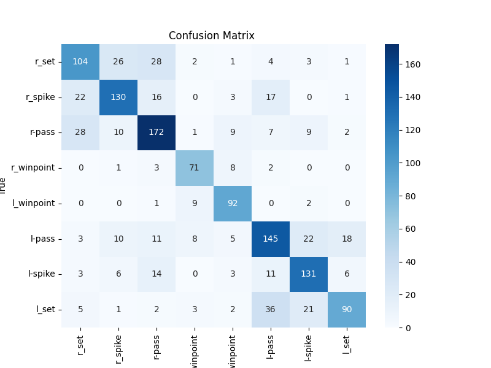
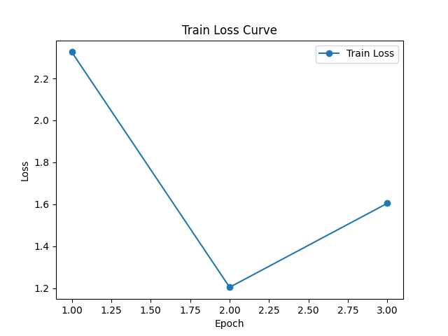
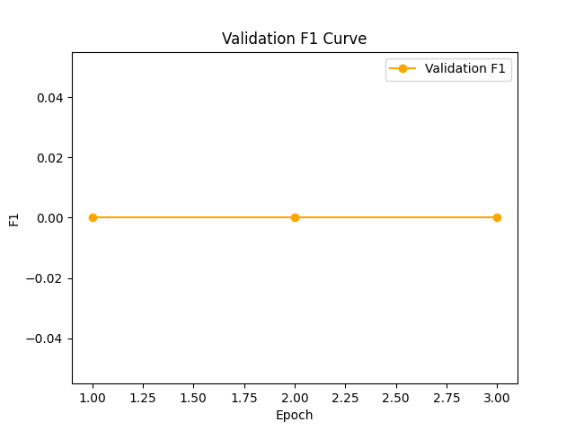
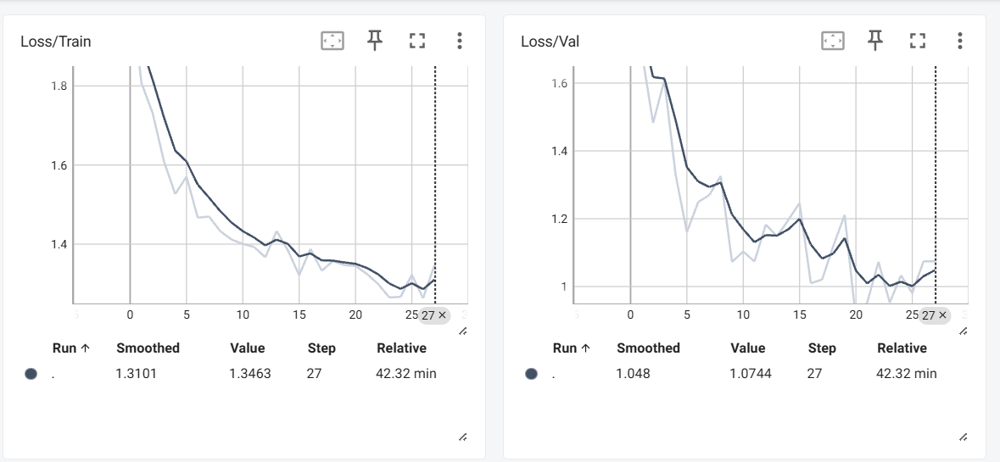
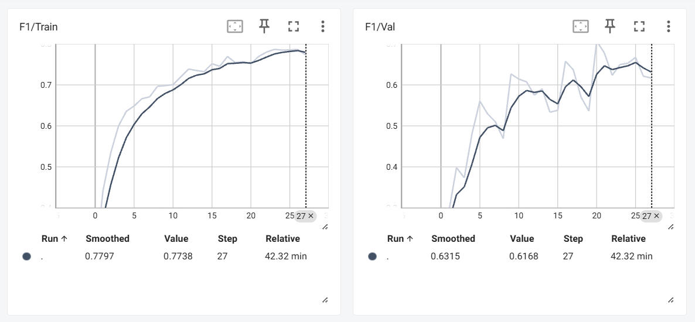

# Group Activity Recognition  
### CVPR Baseline B1 Reproduction (Image-based Model)

This repository implements the **image-based baseline (B1)** from the CVPR/TPAMI paper  
**"A Hierarchical Deep Temporal Model for Group Activity Recognition"**.

The project focuses on reproducing the **single-frame group activity recognition baseline**
using a stronger CNN backbone and a modern, reproducible training pipeline.

---
## Contents

- [Paper Reference](#paper-reference)
- [Implemented Baseline](#implemented-baseline)
- [Model Architecture](#model-architecture)
- [Training Pipeline](#training-pipeline)
- [Experiment Tracking](#experiment-tracking)
- [Dataset](#dataset)
- [Results](#results)
  - [Metrics](#metrics)
  - [Confusion Matrix](#confusion-matrix)
  - [Training Curves](#training-curves)
- [Project Structure](#project-structure)
- [Future Work](#future-work)
- [Author](#author)


## Paper Reference
Ibrahim et al., *A Hierarchical Deep Temporal Model for Group Activity Recognition*  
CVPR 2016 / IEEE TPAMI  
https://www.cs.sfu.ca/~mori/research/papers/ibrahim-cvpr16.pdf

---

## Implemented Baseline
- **Baseline:** B1 – Image-based Classification  
- **Input:** Single RGB frame (middle frame per clip)  
- **Backbone:** ResNet50 (fine-tuned)  
- **Task:** 8-class group activity classification  
- **Dataset:** Volleyball Dataset  

> This repository implements **only Baseline B1**.  
> Temporal and hierarchical models are **not included**.

---

## Model Architecture
- Pretrained **ResNet50**
- Final classification layer adapted for 8 group activity classes
- End-to-end fine-tuning with weighted cross-entropy loss

---

## Training Pipeline
- Class imbalance handling using **class weights**
- Optional **Mixup** augmentation
- **Early stopping** based on validation macro F1-score
- Learning rate scheduling (StepLR / Cosine Annealing)
- Best model checkpointing
- Reproducibility via fixed random seeds

---

## Experiment Tracking
- **MLflow** for experiment tracking and metrics logging
- **TensorBoard** for training visualization
- Structured logging using Python logging

---

## Dataset
- **Volleyball Dataset**
- 8 group activity classes
- Middle-frame sampling per clip (configurable)

> Dataset annotations are loaded from a preprocessed pickle file.

---

## Results
Evaluation is performed on the validation split using **macro F1-score**.

### Metrics
- Macro F1-score: **0.7302**
- Per-class precision, recall, and F1 reported

### Confusion Matrix
<p align="center">
  
</p>

### Training Curves
<p align="center">
  
  
</p>

## TensorBoard Training Curves

### Training and Validation Loss (TensorBoard)


### Training and Validation F1_score (TensorBoard)


---

## Project Structure

```text
activity-recognition-volleyball/
├── configs/
│   └── B1.yaml                 # Training configuration for B1 baseline
│
├── outputs/
│   └── B1/
│       ├── checkpoints/        # Best trained model
│       ├── mlruns/             # MLflow experiment tracking
│       └── results/
│           ├── plots/          # Loss, F1, confusion matrix
│           ├── tables/         # CSV & classification reports
│           └── tensorboard/    # TensorBoard logs
│
├── scripts/
│   └── run_baseline.py         # Entry-point script
│
├── src/
│   ├── datasets/               # Dataset loaders
│   ├── models/                 # ResNet50 B1 model
│   ├── pipelines/
│   │   └── B1/                 # Training & evaluation pipelines
│   ├── engine/                 # Trainer & evaluator logic
│   ├── mlflow/                 # Experiment logging utilities
│   ├── utils/                  # Mixup, plots, seed, logging
│   └── utils_data/             # Annotation & bounding box utilities
│
├── .gitignore
└── README.md

```

---

## Future Work

* Person-based modeling (Baseline B3)
* Temporal modeling using LSTM (Baselines B4, B5)
* Two-stage hierarchical temporal model
* Team-aware scene representations

---

## Author

**Youssef Ibrahim**
AI / Machine Learning Engineer

* GitHub: [https://github.com/youssefibrahim258](https://github.com/youssefibrahim258)
* LinkedIn: [https://www.linkedin.com/in/youssef-ibrahim-179738243/](https://www.linkedin.com/in/youssef-ibrahim-179738243/)

```
